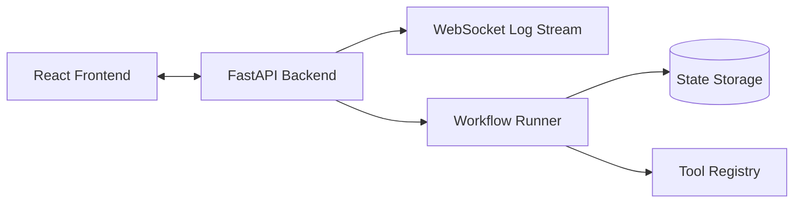
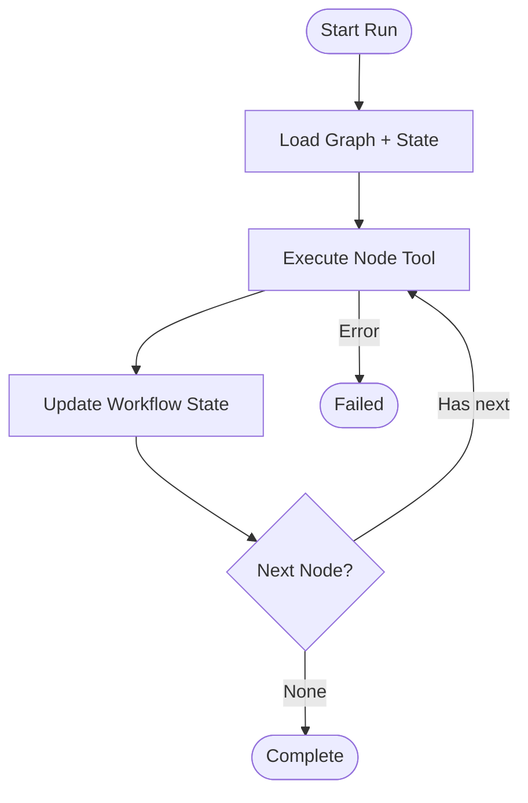
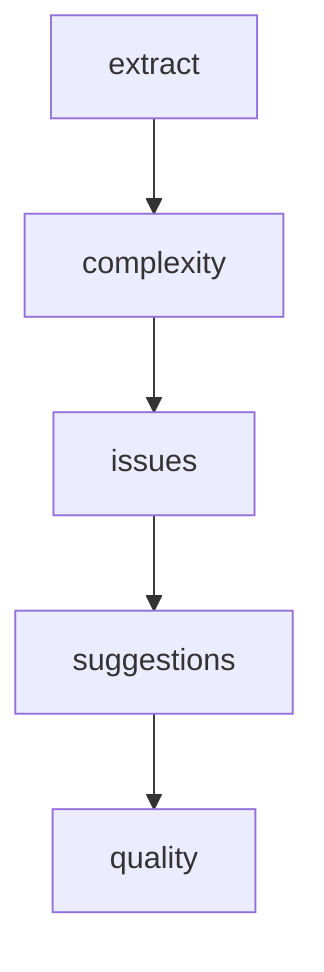

# 🚀 **Agent Workflow Engine**

A modular, asynchronous **workflow execution engine** built using FastAPI.
It supports dynamic workflow graphs, intelligent node execution, state persistence, WebSocket logging, and pause/resume controls.

A minimal React UI is included to visualize workflow execution, though the **backend workflow system is the main focus**.

#### 🔗 **Live Demo** : [https://agent-workflow-engine.onrender.com](https://agent-workflow-engine.onrender.com)

---

## 📘 Table of Contents
- [Overview](#overview)
- [Key Features](#key-features)
- [Architecture](#architecture)
- [Architecture Diagrams](#architecture-diagrams)
- [How the Workflow Engine Works](#how-the-workflow-engine-works)
- [Developer Setup Guide](#developer-setup-guide)
- [API Reference](#api-reference)
- [Swagger / OpenAPI Usage](#swagger--openapi-usage)
- [WebSocket Protocol](#websocket-protocol)
- [Testing](#testing)
- [Deployment (Render)](#deployment-render)
- [Future Enhancements](#future-enhancements)
- [Contributor](#contributor)

---

## 🌐 Overview

The **Agent Workflow Engine** executes workflows represented as directed graphs.
A workflow is composed of:

* **Nodes** → operations implemented as *tools*
* **Edges** → transitions between nodes
* **Shared state** → passed and updated throughout execution

Nodes may run synchronous or asynchronous Python functions.
Execution happens in a **WorkflowRunner** that supports:

* State-aware execution
* Real-time WebSocket logging
* Pause/resume
* Error handling
* Persistence hooks
* Branching logic

The included example workflow is **Code Review Agent**.

---

## ✨ Key Features

### 🔧 Workflow Execution Engine

* Directed graph–based node execution
* Conditional branching
* Loop protection (iteration limits)
* Node-level config support

### 🧰 Pluggable Tool Registry

Register functions as reusable tools:

```python
tool_registry.register("extract_functions", extract_functions)
```

### 📡 Real-Time Logs (WebSocket)

The engine streams logs through:

```
wss://<host>/ws/<run_id>
```

### ⏸ Pause / ▶ Resume Supported

Workflow execution can be controlled externally.

### 🗄 Pluggable Storage

* In-memory (default)
* MongoDB-ready interface

### 🖥 Optional UI

React UI for interactive execution monitoring.

---

## 🧱 Architecture

```
app/
│
├── api/
│   ├── graph.py         # REST endpoints
│   └── websocket.py     # WebSocket log server
│
├── engine/
│   ├── graph.py         # Graph and node models
│   ├── runner.py        # Core execution engine
│   ├── state.py         # WorkflowState + StateManager
│   ├── registry.py      # Tool registry
│   └── nodes.py         # Node helpers
│
├── storage/
│   ├── memory.py
│   └── mongo.py
│
├── workflows/
│   └── code_review/
│        ├── nodes.py
│        └── workflow.py
│
└── main.py              # FastAPI app + static frontend hosting
```

---

## 🧩 Architecture Diagrams

###  **High-Level System Diagram**



---

###  **Workflow Execution Flow**



---

### **Graph Structure**



---

## 🧪 How the Workflow Engine Works

1. **Client sends graph_id + initial_state**
2. **Runner loads graph + creates WorkflowState**
3. Executes from `entry_node`
4. For each node:

   * Fetch tool
   * Run tool
   * Update state
   * Append log
   * Broadcast WebSocket message
   * Move to next node
5. Final state saved → runner ends

Supports:

* Stop on error
* Pause/resume
* State persistence after every log entry

---

## 🧑‍💻 Developer Setup Guide

### 1️⃣ Clone repo

```bash
git clone https://github.com/dheerajpapani/agent-workflow-engine.git
cd agent-workflow-engine
```

### 2️⃣ Backend setup

```bash
python -m venv venv
# Windows
venv\Scripts\activate
# Mac/Linux
source venv/bin/activate

pip install -r requirements.txt
uvicorn app.main:app --reload --port 8080
```

### 3️⃣ Frontend setup (optional)

```bash
cd frontend
npm install
npm run dev
```

### Production frontend build:

```bash
npm run build
```

The backend serves the built frontend automatically.

---

## 📡 API Reference

### ▶ **Create Code Review Workflow**

```
POST /graph/create/code-review
```

### ▶ **Run Workflow**

```
POST /graph/run
```

Body:

```json
{
  "graph_id": "abcd1234",
  "initial_state": { "code": "def foo(): return 1" }
}
```

### ▶ **Get State**

```
GET /graph/state/<run_id>
```

### ▶ **Pause / Resume**

```
POST /graph/pause/<run_id>
POST /graph/resume/<run_id>
```

### ▶ **List Graphs**

```
GET /graph/list
```

### ▶ **Delete Graph**

```
DELETE /graph/<graph_id>
```

---

## 📘 Swagger / OpenAPI Usage

The backend automatically exposes:

👉 **Swagger UI**

```
https://agent-workflow-engine.onrender.com/docs
```

👉 **ReDoc**

```
https://agent-workflow-engine.onrender.com/redoc
```

You can test endpoints directly using Swagger forms.

---

## 🔌 WebSocket Protocol

### Connect

```
wss://agent-workflow-engine.onrender.com/ws/<run_id>
```

### Message Types

| Type      | Description                    |
| --------- | ------------------------------ |
| connected | client successfully subscribed |
| log       | log entry from runner          |
| keepalive | keep-alive ping                |

### Example

```json
{ "type": "log", "run_id": "abc", "message": "[2025] Node completed" }
```

---

## 🧪 Testing

Run all tests:

```bash
pytest -q
```

Includes:

* Node-level tests
* Runner engine tests
* Integration test covering full Code Review workflow

---

## ☁ Deployment (Render)

Render uses `render.yaml` to:

1. Install backend dependencies
2. Install + build frontend
3. Start FastAPI using Uvicorn

### Start Command

```bash
uvicorn app.main:app --host 0.0.0.0 --port $PORT
```

### Live service:

[https://agent-workflow-engine.onrender.com](https://agent-workflow-engine.onrender.com)

---

## 🔮 Future Enhancements

* Parallel workflow execution
* Built-in retry scheduling
* Role-based access control
* Visual DAG workflow builder UI
* Add Redis/MongoDB storage drivers
* Multi-agent workflow orchestration

---

## 👤 Contributor

**Dheeraj Papani**
AI Engineer | Backend & Systems Development

[](https://www.linkedin.com/in/dheeraj-papani-507693274/)
[](https://github.com/dheerajpapani)
[](https://mail.google.com/mail/?view=cm&fs=1&to=dheerajpapani@gmail.com)


---

## ⭐ Like this project

Star the repository to support future improvements!

---
